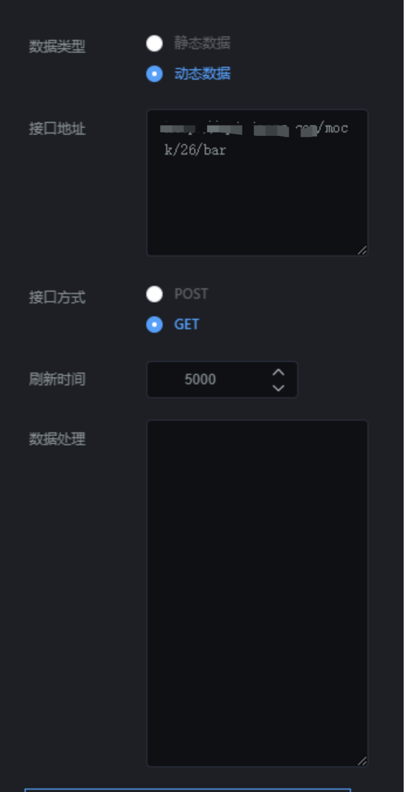

象形图组件就是添加象形图的组件。点击“”图标，再点击“象形图”，即可创建新的图像，如图 2.51；

  


## **一、组件名称设置**

选中象形图组件，在操作界面右侧的“图层名称”处可修改组件的名称，如图 2.52。（名称最好要设置一下，方便后期组件管理）

  


## **二、图标**

选中该象形组件，在操作界面右侧，输入图片地址，即可自定义设置象形图图标，如图 2.53。

  


## **三、图标字号**

选中该象形图组件，在操作界面右侧，选择图标字号，可设置图标的大小，如图 2.54。

  


## **四、字体设置**

包含设置“字体大小、字体颜色”，如图 2.55。

  


## **五、轴字体颜色**

选中该象形图组件，在操作界面右侧，选择轴字体颜色，可设置轴文字的颜色（即 Y 轴文字的颜色），如图 2.56。

  


## **六、间距**

选中该象形图组件，在操作界面右侧，调整“间距”大小，可修改组件 Y 轴之间的间距，如图 2.57。

  


## **七、Y 轴设置**

选中该象形图组件，在操作界面右侧的“Y 轴设置”处可设置 Y 轴的样式，如图 2.58。

- 显示：是否显示 Y 轴字体；

- 字号：Y 轴字体的大小；

  


## **八、坐标轴边距设置**

选中该象形图组件，在操作界面右侧的“坐标轴边距设置”处可配置距离左、右、上、下的距离，如图 2.59。

- 左边距（像素）：柱形图距离左边的距离；

- 顶边距（像素）：柱形图距离顶部的距离；

- 右边距（像素）：柱形图距离右边的距离；

- 底边距（像素）：柱形图距离底部的距离；

  


## **九、接口设置**

选中该象形图组件，在操作界面右侧，点击“”，可设置接口，如图 2.591。

### 1\. 数据类型

### 数据类型分为静态数据和动态数据；

- 静态数据：写死的数据；
- 动态数据：会随着接口传过来的数据实时变化；（一般这种比较常用）

#### （1）静态数据，接口地址传过来的内容要符合以下格式：

```
[
    {
        "name": "苹果",
        "value": 1000879
    },
    {
        "name": "三星",
        "value": 3400879
    },
    {
        "name": "小米",
        "value": 2300879
    },
    {
        "name": "oppo",
        "value": 5400879
    },
    {
        "name": "大疆",
        "value": 3000
    },
    {
        "name": "抖音",
        "value": 2000
    }
]

```

#### （2）动态数据，接口地址传过来的内容要符合以下格式：

```
{"data":[{"name":"苹果","value":1000879},{"name":"三星","value":3400879},{"name":"小米","value":2300879},{"name":"oppo","value":5400879},{"name":"大疆","value":3000}]}

```

### 2\. 接口地址

- name：为标签名称；
- value：为标签值；

### 3\. 刷新时间

这个参数主要针对动态数据设置的，完成数据的实时更新。

- 如果你想设置成 5 秒刷新一次，可以将刷新时间设置成“5000”；

### 4\. 刷新数据

这个参数主要是重新请求以下接口，完成数据的更新。



