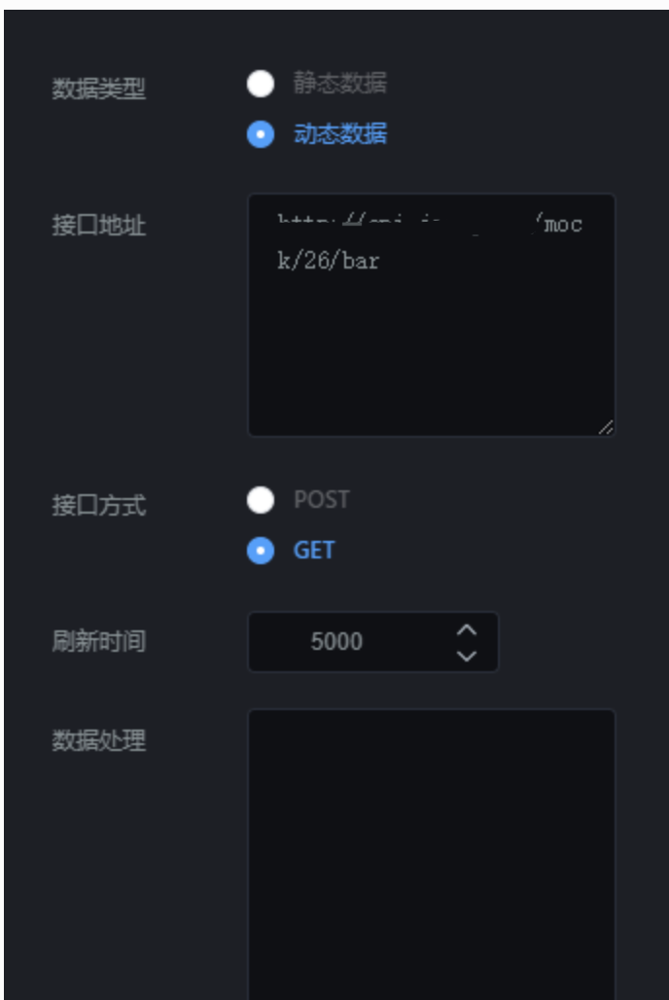

漏斗图组件就是添加漏斗图样式的组件。点击“”图标，再点击“漏斗图”，即可创建新的图像，如图 2.81；

  


## **一、组件名称设置**

选中漏斗图组件，在操作界面右侧的“图层名称”处可修改组件的名称，如图 2.82。（名称最好要设置一下，方便后期组件管理）

  


## **二、系统配色**

选中该漏斗图组件，在操作界面右侧，打开“系统配色”开关，在“配色选择”下拉框中选择主题，来修改漏斗图组件的配色，如图 2.83。

  


## **三、文字设置**

选中该漏斗图组件，在操作界面右侧的“文字设置”处可修改漏斗图组件内文字样式，如图 2.84。

- 显示开关：该开关控制内部文字的显示与隐藏；

- 字体大小：设置内部文字的大小；

- 字体颜色：设置内部文字的颜色；

- 字体粗细：设置内部文字的粗细；

  


## **四、反转**

选中该漏斗图组件，在操作界面右侧，打开“反转”开关，可将漏斗图反转 180 度，如图 2.85。（效果图 2.851）

  
  
  


## **五、标题设置**

选中该漏斗图组件，在操作界面右侧的“标题设置”处可修改漏斗图组件的标题样式，如图 2.86。

- 标题开关：该开关控制标题的显示与隐藏；

- 标题：标题显示的内容；

- 字体颜色：标题的颜色；

- 字体粗细：标题字体的粗细；

- 字体大小：标题字体大小；

- 字体位置：标题的位置，分为：居中、左对齐、右对齐；

- 副标题：副标题内容；

- 字体颜色：副标题字体颜色；

- 字体粗细：副标题字体的粗细；

- 字体大小：副标题字体大小；

  


## **六、字体设置**

选中该漏斗图，在操作界面右侧的“字体设置”处可修改漏斗图组件的文字样式，如图 2.87。

- 显示：文字是否显示；

- 字体大小：文字的大小；

- 字体颜色：文字的颜色；

- 字体粗细：文字的粗细；

  


## **七、提示语设置**

选中该漏斗图组件，在操作界面右侧的“提示语设置”处可修改漏斗图组件的提示语样式，如图 2.88。

- 字体大小：提示语的字体大小；

- 字体颜色：提示语的字体颜色；

  


## **八、图例设置**

选中该漏斗图组件，在操作界面右侧的“图例设置”处可设置图例的样式，如图 2.89。

- 图例开关：是否显示图例；

- 位置：图例的位置，分为：居中、左对齐、右对齐；

- 布局朝向：图例的排列顺序，分为：横排和竖排；

- 字体大小：图例的字体大小；

  


## **九、自定义配色设置**

选中该漏斗图组件，在操作界面右侧的“自定义配色”处可配置上边不能设置的内容，如图 2.891。

- 文字颜色：轴文字的颜色；（因为漏斗图没有轴，所以不需要设置）

- 轴线颜色：轴线颜色；（因为漏斗图没有轴，所以不需要设置）

- 配色：漏斗图每层的颜色，如果开启了“系统配色”，需要先把系统配色先关掉，这样自定义的颜色才起作用；

  


## **八、接口设置**

选中该漏斗图组件，在操作界面右侧，点击“”，可设置接口，如图 2.892。

### 1\. 数据类型

数据类型分为静态数据和动态数据；

- 静态数据：写死的数据；

- 动态数据：会随着接口传过来的数据实时变化；

### 2\. 接口地址

#### （1）静态数据，接口地址传过来的内容要类似以下格式：

```
[{"value":335,"name":"直接访问"},{"value":310,"name":"邮件营销"},{"value":234,"name":"联盟广告"}]

```

#### （2）动态数据，接口地址传过来的内容要类似以下格式：

```
{"data":[{"value":335,"name":"直接访问"},{"value":310,"name":"邮件营销"},{"value":234,"name":"联盟广告"}]}

```

### 3\. 刷新时间

这个参数主要针对动态数据设置的，完成数据的实时更新。

- 如果你想设置成 5 秒刷新一次，可以将刷新时间设置成“5000”；

### 4\. 刷新数据

这个参数主要是重新请求以下接口，完成数据的更新。



