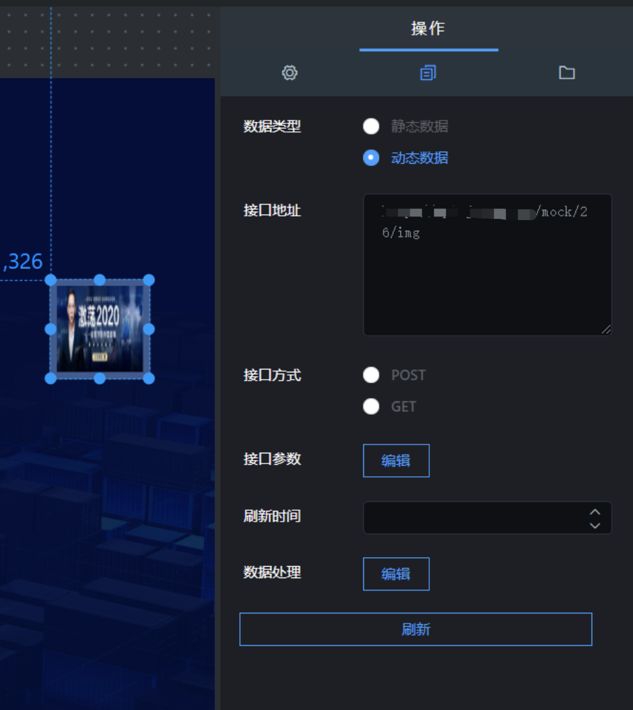

图片组件就是设置图片样式的组件。点击“”图标，再点击“图片”，即可创建图片，如图 4.11；

  


## **一、组件名称设置**

选中该图片组件，在操作界面右侧的“图层名称”处可修改组件的名称，如图 4.12。（名称最好要设置一下，方便后期组件管理）

  


## **二、图片设置**

- 开启旋转：将图片效果设置为旋转，再在“旋转时间”处设置时间，就可控制旋转速度了；
- 透明度：设置图片的透明度；
- 图片地址：可以点击文本框右侧图片按钮，选择图片库内图片；也可在图 4.13 标注 1 中填写图片在某一服务器上的存储地址；也可点击图 4.13 标注 2 按钮，从本地上传图片；

  


## **三、接口设置**

1\. 数据类型

### 数据类型分为静态数据和动态数据；

- 静态数据：写死的数据；
- 动态数据：会随着接口传过来的数据实时变化；（一般这种比较常用）

### 2\. 接口地址

#### （1）静态数据，接口地址传过来的内容要符合以下格式：

```
{
    "value": "https://img.alicdn.com/tfs/TB1v28TC8v0gK0jSZKbXXbK2FXa-1880-640.jpg"
}

```

#### （2）动态数据，接口地址传过来的内容要符合以下格式：

```
{"value":"https://img.alicdn.com/tfs/TB1v28TC8v0gK0jSZKbXXbK2FXa-1880-640.jpg"}

```

### 3\. 刷新时间

这个参数主要针对动态数据设置的，完成数据的实时更新。

- 如果你想设置成 5 秒刷新一次，可以将刷新时间设置成“5000”；

### 4\. 刷新数据

这个参数主要是重新请求以下接口，完成数据的更新。



