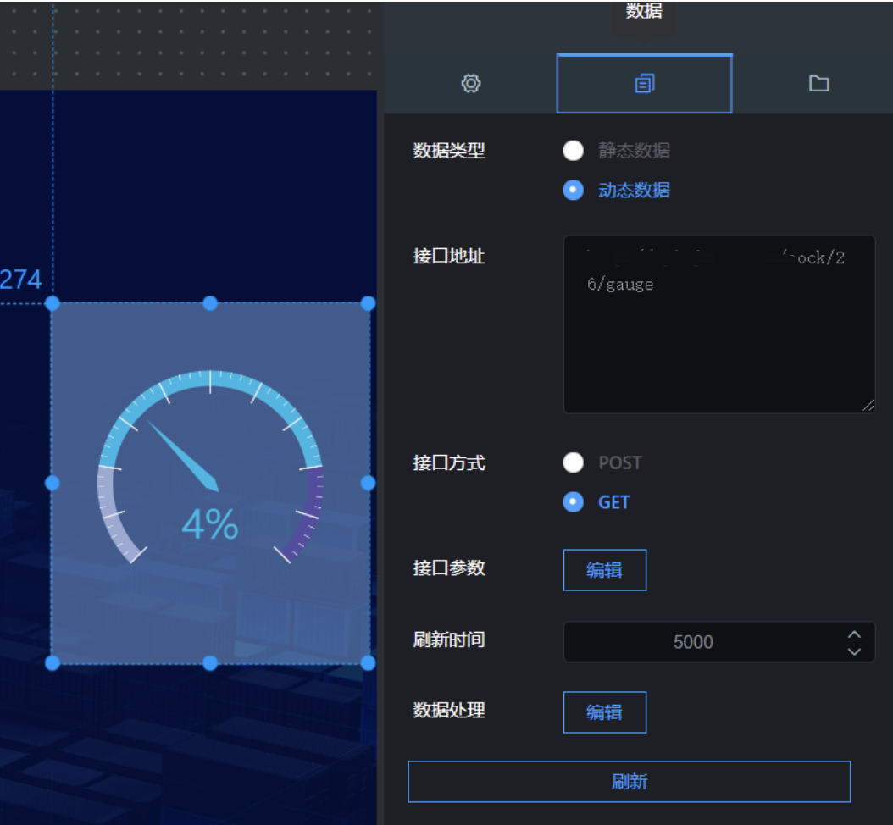

仪盘表组件就是设置仪盘效果的组件，效果图如图 5.21。点击“”图标，再点击“仪盘表”，即可创建仪盘表，如图 5.22；

  
  
  


## **一、组件名称设置**

选中该仪盘表组件，在操作界面右侧的“图层名称”处可修改组件的名称，如图 5.23。（名称最好要设置一下，方便后期组件管理）

  


## **二、基本样式设置**

### 1\. 刻度线粗度(像素)

选中该仪盘表组件，在操作界面右侧的“刻度线粗度(像素)”处可设置组件的轮播时间，如图 5.24；

  


### 2\. 设置刻度值

选中该仪盘表组件，在操作界面右侧，打开“显示刻度”按钮，可在仪盘表显示刻度，设置字号处可修改刻度子的大小，如图 5.25。

  


### 3\. 显示刻度线

选中该仪盘表组件，在操作界面右侧的“显示刻度线”处可设置是否显示刻度线，如图 5.26。（图 5.27 为显示刻度线样式；图 5.28 为不显示刻度线样式；）

  
  


### 3\. 指标字号

选中该仪盘表组件，在操作界面右侧的“指标字号”处可设置指标名称字的大小，如图 5.26。

  


## **三、接口设置**

### 1\. 数据类型

数据类型分为静态数据和动态数据；

- 静态数据：写死的数据；

- 动态数据：会随着接口传过来的数据实时变化；（一般这种比较常用）

### 2\. 接口地址

#### （1）静态数据，接口地址穿过来的内容要符合以下格式：

```
{
    "min": 1,
    "max": 10,
    "label": "名称",
    "value": 2,
    "unit": "%"
}

```

#### （2）动态数据，接口地址穿过来的内容要符合以下格式：

```
{"data":{"min":1,"max":10,"label":"名称","value":4,"unit":"%"}}

```

### 3\. 刷新时间

这个参数主要针对动态数据设置的，完成数据的实时更新。

- 如果你想设置成 5 秒刷新一次，可以将刷新时间设置成“5000”；

### 4\. 刷新数据

这个参数主要是重新请求以下接口，完成数据的更新。



