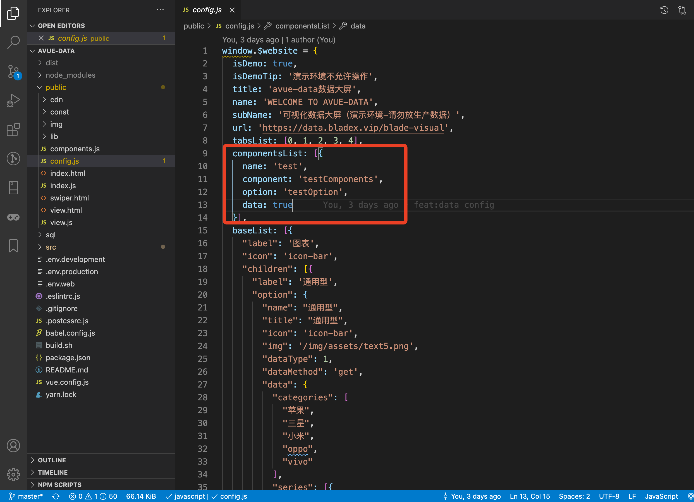
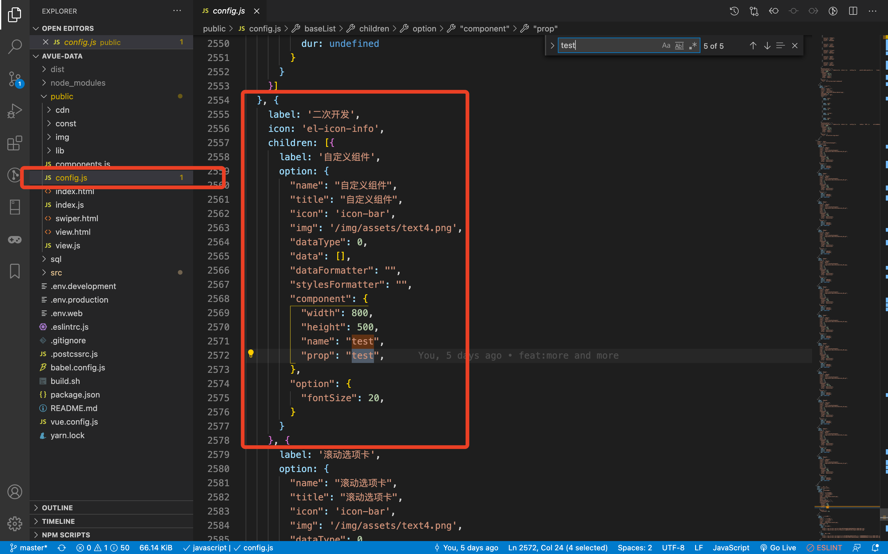

!>如果系统中组件无法满足我们的应用场景，我们可以自定义开发任意组件来集成

## ① 文件位置

> 在项目的如下路径添加 components.js & config.js

- components.js 定义组件

- config.js 配置此组件让 datav 加载

```
├── src
│   ├── main
│   │   └── resources
│   │       ├── META-INF
│   │       │   └── resources
│   │       │       ├── components.js
│   │       │       └── config.js

```

## ② 组件模块

> 编写组件的模块/public/components.js

```js
const testComponents = {
  template: `
  <div :style="[styleSizeName,styleName]"
    :class="className">
    <div :style="styleChartName">
      <h2>自定义组件</h2><br />
      <h3>我是参数:{{option}}</h3><br />
      <h3>data:{{dataChart}}</h3><br />
      <h3>params:{{(dataAxios.config || {}).params}}</h3><br />
    </div>
  </div>
`,
  name: 'test',
  props: {
    option: Object,
    component: Object,
  },
  computed: {
    styleName() {
      return {
        fontSize: this.fontSize,
        color: this.color,
      };
    },
    color() {
      return this.option.color || '#fff';
    },
    fontSize() {
      return (this.option.fontSize || 30) + 'px';
    },
  },
};
```

## ③ 配置模块

> 编写组件配置项模块 components.js

```js
const testOption = {
  template: `
  <div>
    <el-form-item label="字体大小">
      <avue-input-number v-model="main.activeOption.fontSize"></avue-input-number>
    </el-form-item>
    <el-form-item label="字体颜色">
      <avue-input-color v-model="main.activeOption.color"></avue-input-color>
    </el-form-item>
  </div>
`,
  name: 'test',
  inject: ['main'],
};
```

## ④ 组件配置

> 配置文件文件路径config.js



## ⑤ 组件引用

> 配置文件文件路径/public/config.js



## ⑥ 最终效果


