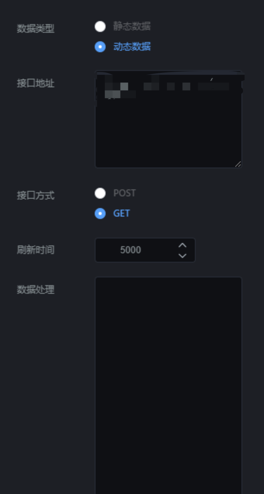

## ① 添加折线图的组件

折线图组件就是添加折线图的组件。点击“”图标，再点击“折线图”，即可创建新的图像，如图 2.21；

  


## ② 组件名称设置

选中折线图组件，在操作界面右侧的“图层名称”处可修改组件的名称，如图 2.22。（名称最好要设置一下，方便后期组件管理）

  


## ③ 系统配色

选中该折线图组件，在操作界面右侧，打开“系统配色”开关，在“配色选择”下拉框中选择主题，来修改折线图组件的配色，如图 2.23。

- 默认配色：效果图如图 2.231；
- 紫色主题：效果图如图 2.232；
- 绿色主题：效果图如图 2.233；

  
  


## ④ 位置设置

选中该折线图组件，在操作界面右侧，打开“竖展示”开关，可修改折线图组件的显示方向，如图 2.24；效果图如图 2.241。

  
  
  


## ⑤ 折线设置

选中该折线图组件，在操作界面右侧的“折线设置”处可修改设置组件的外观特点，如图 2.25。

- 标记点：设置折线图上是否有标记点，默认有标记点；（关闭标记点开关，效果图如图 2.251；打开标记点开关，效果图如图 2.252）
- 点大小：设置标记点的大小；
- 平滑曲面开关：设置折线图是平滑曲面还是折线，默认是平滑曲面；（关闭平滑曲面开关，效果图如图 2.253；打开平滑曲面开关，如图 2.254）
- 阶梯线图：包含当前点、中间点、下个拐点。当前点指：当前点做阶梯拐点，如图 2.255；中间点指：当前为中间点做拐点，如图 2.256；下个拐点：下个点做拐点，如图 2.257。
- 面积堆积：设置折线图是否是面积堆积样式；（关闭面积堆积开关，效果图图如图 2.258，打开面积堆积开关，效果图如图 2.259）
- 线条宽度：设置线条的宽度；（图 2.25 标记 1）

  
  
  
  
  


## ⑥ 标题设置

选中该折线图组件，在操作界面右侧的“标题设置”处可修改折线图组件的标题样式，如图 2.26。

- 标题开关：该开关控制标题的显示与隐藏；
- 标题：标题显示的内容；
- 字体颜色：标题的颜色；
- 字体粗细：标题字体的粗细；
- 字体大小：标题字体大小；
- 字体位置：标题的位置，分为：居中、左对齐、右对齐；
- 副标题：副标题内容；
- 字体颜色：副标题字体颜色；
- 字体粗细：副标题字体的粗细；
- 字体大小：副标题字体大小；


## ⑦ X 轴设置

选中该折线图组件，在操作界面右侧的“X 轴设置”处可修改折线图组件的 X 轴样式，如图 2.27。

- 名称：X 轴的名称；
- 显示：X 轴是否显示；
- 显示网格：网格是否显示；（打开显示网格线开关，效果图如图 2.271）
- 轴线颜色：网格线颜色设置；
- 标签间距：每个类型之间的距离；
- 文字角度：X 轴文字的旋转角度；（调整文字角度，效果图如图 2.272）
- 轴反转：折线图顺序左右调转；
- 字号：X 轴字体大小；

  
  


## ⑧ Y 轴设置

选中该折线图组件，在操作界面右侧的“Y 轴设置”处可修改折线图组件的 Y 轴样式，如图 2.28。

- 名称：Y 轴的名称；
- 显示：Y 轴是否显示；
- 轴网格线：网格是否显示；
- 轴线颜色：网格线颜色设置；
- 轴反转：折线图顺序上下调转；
- 字号：Y 轴字体大小；

  


## ⑨ 字体设置

选中该折线图，在操作界面右侧的“字体设置”处可修改折线图组件上文字的样式，如图 2.29。

!> 备注：上边“折线设置 ->标记点”开关一定打开

- 显示：数值文字是否显示；
- 字体大小：文字的大小；
- 字体颜色：文字的颜色；
- 字体粗细：文字的粗细；

  


## ⑩ 提示语设置

选中该折线图组件，在操作界面右侧的“提示语设置”处可修改折线图组件的提示语，如图 2.291；效果图如图 2.292；

- 字体大小：提示语的字体大小；
- 字体颜色：提示语的字体颜色；

  
  
  


## 11 坐标轴边距设置

选中该折线图组件，在操作界面右侧的“坐标轴边距设置”处可修改折线图距离左、右、上、下的距离，如图 2.293。

- 左边距（像素）：折线图距离左边的距离；
- 顶边距（像素）：折线图距离顶部的距离；
- 右边距（像素）：折线图距离右边的距离；
- 底边距（像素）：折线图距离底部的距离；

  


## 12 图例设置

选中该折线图组件，在操作界面右侧的“图例设置”处可设置图例的样式，如图 2.294；效果图如图 2.295。

- 图例开关：是否显示图例；
- 字体颜色：图例的字体颜色。如果要想自定义图例的颜色，需要关闭系统配色（图 2.2951）和删除所有自定义配色（图 2.2952）中的颜色。
- 图例宽度：图例的宽度；
- 横向位置：图例的位置，分为：居中、左对齐、右对齐，如图 2.2953；
- 纵向位置：图例的位置，分为：顶部、底部，如图 2.2954；
- 布局朝向：图例的排列顺序，分为：横排和竖排，如图 2.2955；
- 字体大小：图例的字体大小；

  
  
  
  
  
  
  
  
  
  
  
  
  


## 13 自定义配色设置

选中该折线图组件，在操作界面右侧的“自定义配色设置”处可配置上边不能设置的内容，如图 2.296。

- 文字颜色：X、Y 轴字体的颜色；
- 轴线颜色：X、Y 轴轴线颜色；
- 配色：折线的颜色，如果开启了“系统配色”，需要先把系统配色先关掉，这样自定义的颜色才起作用；

  


## 14 接口设置

选中该折线图组件，在操作界面右侧，点击“”，可设置接口，如图 2.297。

### 1\. 数据类型

数据类型分为静态数据和动态数据；

- 静态数据：写死的数据；
- 动态数据：会随着接口传过来的数据实时变化；（一般这种比较常用）

#### （1）静态数据，接口地址传过来的内容要符合以下格式：

```
{"categories":["苹果","三星","小米","oppo","vivo"],"series":[{"name":"手机品牌","data":[1000879,3400879,2300879,5400879,3400879]},{"name":"手机品牌销售","data":[100087,340087,230087,540087,340087]}]}

```

#### （2）动态数据，接口地址传过来的内容要符合以下格式：

```
{"data":{"categories":["苹果","三星","小米","oppo","vivo"],"series":[{"name":"手机品牌","data":[1000879,3400879,2300879,5400879,3400879]},{"name":"手机品牌销售","data":[100087,340087,230087,540087,340087]}]}}

```

### 2\. 接口地址

- categories：X 轴参数；
- series：柱形内容；内部 name 为柱形名称，data 为柱形相对应 Y 轴的值；

### 3\. 刷新时间

这个参数主要针对动态数据设置的，完成数据的实时更新。

- 如果你想设置成 5 秒刷新一次，可以将刷新时间设置成“5000”；

### 4\. 刷新数据

这个参数主要是重新请求以下接口，完成数据的更新。



