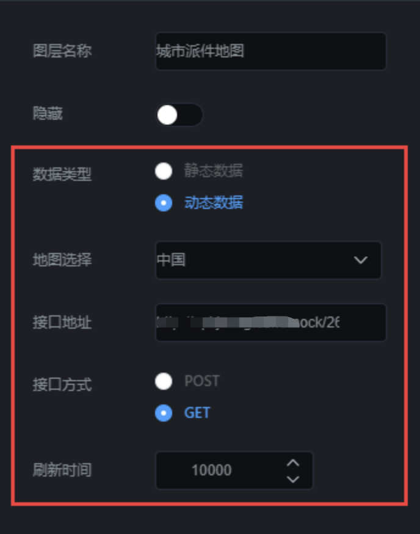

<iframe src="//player.bilibili.com/player.html?aid=940113007&bvid=BV1pW4y167jn&cid=747212626&page=1&high_quality=1" scrolling="no" border="0" frameborder="no" framespacing="0" allowfullscreen="true" width="100%" height="600"> </iframe>

地图组件就是添加地图样式的组件。点击“”图标，再点击“地图”，即可创建新的图像，如图 7.11；

  


## **一、组件名称设置**

选中地图组件，在操作界面右侧的“图层名称”处可修改组件的名称，如图 7.12。（名称最好要设置一下，方便后期组件管理）

  


## **二、轮播**

选中该地图组件，在操作界面右侧，打开“开启轮播”开关，在“轮播时间”文本框中输入时间，来设置地图组件的轮播样式，如图 7.13。

- 如果轮播时间想设为 5 秒，可在轮播时间的文本框中填写 5000；

  


## **三、地图选择**

选中该地图组件，在操作界面右侧的“地图选择”处通过选择不同的地区来改变地图样式，如图 7.14。

  


## **四、地图比例**

选中该地图组件，在操作界面右侧，拖动“地图比例”大小，来设置地图样式，如图 7.15。

  


## **五、字体设置**

选中该地图，在操作界面右侧的“字体设置”处可修改地图组件的文字样式，如图 7.16。

- 字体大小：文字的大小；

- 字体高亮颜色：鼠标点击的时候高亮显示的颜色；

- 字体颜色：文字的颜色；

  


## **六、区域设置**

选中该地图组件，在操作界面右侧的“提示语设置”处可修改地图组件的提示语，如图 7.17。

- 区域线：提示语的字体大小；

- 区域颜色：提示语的字体颜色；

- 区域高亮颜色：提示语的字体颜色；

  


## **七、边框颜色**

选中该地图组件，在操作界面右侧，通过设置边框颜色，来设置地图上区域之间的颜色样式，如图 7.18。

  


## **八、接口设置**

选中该漏斗图组件，在操作界面右侧，点击“”，可设置接口，如图 7.19。

### 1\. 数据类型

数据类型分为静态数据和动态数据；

- 静态数据：写死的数据；

- 动态数据：会随着接口传过来的数据实时变化；

### 2\. 接口地址

#### （1）静态数据，接口地址传过来的内容要类似以下格式：

```
[{"name":"测试坐标1","value":1,"lng":118.30078125,"lat":36.91915611148194,"zoom":1},{"name":"测试坐标2","value":1,"lng":112.21435546875,"lat":37.965854128749434,"zoom":1}]

```

#### （2）动态数据，接口地址传过来的内容要类似以下格式：

```
{"data":[{"name":"测试坐标1","value":1,"lng":118.30078125,"lat":36.91915611148194,"zoom":1},{"name":"测试坐标2","value":1,"lng":112.21435546875,"lat":37.965854128749434,"zoom":1}]}

```

### 3\. 刷新时间

这个参数主要针对动态数据设置的，完成数据的实时更新。

- 如果你想设置成 5 秒刷新一次，可以将刷新时间设置成“5000”；

### 4\. 刷新数据

这个参数主要是重新请求以下接口，完成数据的更新。



